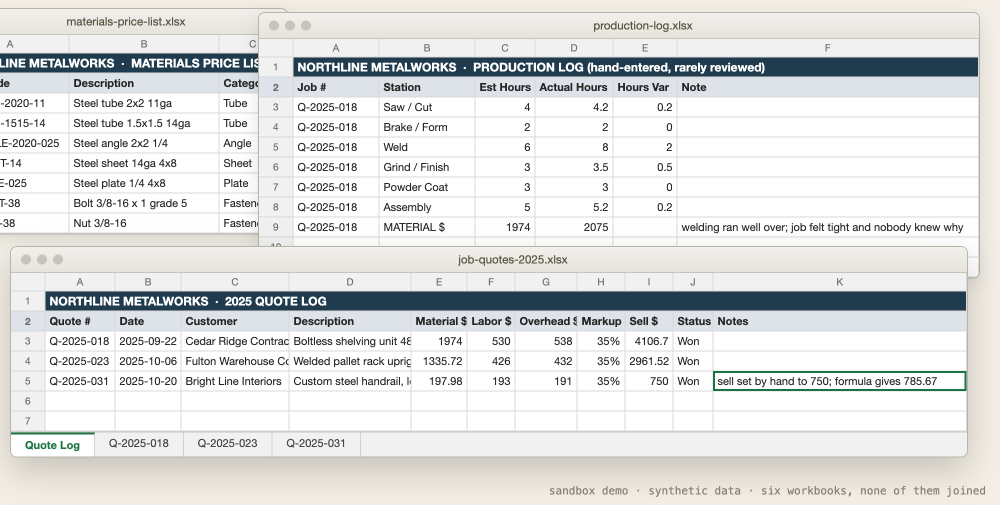
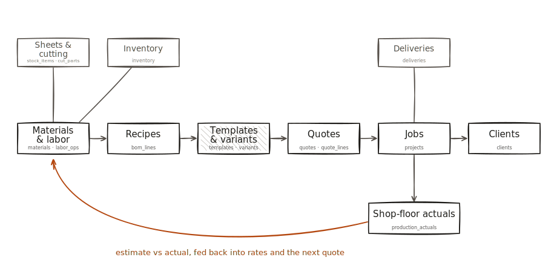

# Operations Blueprint

[](https://github.com/DamianFKao/operations-blueprint/actions/workflows/ci.yml)
[](LICENSE)

Turn ten answers about a small custom or made-to-order manufacturing operation into a tailored, foundation-first operations plan and a runnable starter repo. About 99% of US manufacturers are small businesses, and most operational software is not built or priced for them: it assumes a budget, an IT team, and clean data already in a warehouse. This engine starts from what a small shop actually has. You answer ten questions (what you make, how it varies, how you sell, and so on) and it generates a plan built around one idea: get honest, relational product data first, because everything else depends on it. The output is deterministic (no LLM, no network, the same answers always produce the same plan), free, and MIT licensed.

## Your first 15 minutes

You do not need to install anything to get value out of this repo.

1. **Read a plan for a shop like yours (minutes 0 to 3).** [blueprints/](blueprints/) holds pre-generated blueprints for four invented shops: a custom cabinet shop, a catalog furniture maker, a configurable sign shop, and a minimal general job shop. Each shop now has a hand-drawn map of its system alongside the plan. Pick the closest one, look at its map, and read its `plan.md` and `schema.sql`.
2. **Generate your own (minutes 3 to 8).** Answer the ten questions at [damiankao.com/blueprint](https://damiankao.com/blueprint) (runs in your browser, nothing is sent anywhere), or clone this repo and use the CLI below. Either way you get a plan tailored to your answers and a starter repo you can download or write to disk.
3. **Hand it to a coding agent (the rest).** Open the exported folder in Claude Code or Cursor and paste [prompts/build-with-an-agent.md](prompts/build-with-an-agent.md); the agent starts on the cost engine while you watch. [examples/northline-metalworks](examples/northline-metalworks) shows where that path leads: a working slice, built from an export like yours, that surfaced two money leaks hiding in a shop's own spreadsheets.

## Try it

### In the browser

The quickest way: [damiankao.com/blueprint](https://damiankao.com/blueprint) runs this same engine. Answer the questions, read the plan, download the starter repo as a zip.

### From the command line

The repo ships a small CLI with no dependencies beyond Node built-ins. From a clone:

```
npm install        # also builds dist/, which the CLI imports
node bin/operations-blueprint.mjs --list-options
```

You can also run it as `npx .` from the repo root. Once the package is published to npm (it is not yet), `npx operations-blueprint` will work from anywhere.

Answer the ten questions with flags, an answers file, or a mix. Flags override the answers file, which overrides sensible defaults.

```
# Print a tailored plan (markdown) to stdout
node bin/operations-blueprint.mjs --product metalfab --variation configurable --cuts yes

# Start from an answers.json (same fields, cuts as true/false), override one answer
node bin/operations-blueprint.mjs --answers answers.json --priority production

# Write the full starter repo to a new or empty directory
node bin/operations-blueprint.mjs --answers answers.json --out my-operation

# HTML instead of markdown
node bin/operations-blueprint.mjs --format html > plan.html
```

Flags: `--product`, `--variation`, `--cuts` (yes|no), `--state`, `--team`, `--priority`, `--install`, `--inventory`, `--sales`, `--orders`, `--answers <file>`, `--out <dir>`, `--format <md|html>`, `--list-options`, `--help`. Run with no arguments to see usage plus every question and its valid values. Bad values exit 1 and print the valid options. The CLI refuses to write into a non-empty `--out` directory, so it never overwrites your files. There are no interactive prompts yet; that is deliberately deferred.

### As a library

The package is not on npm yet, so use a clone: `npm install` builds `dist/`, and you can import from it (or `npm link` the package locally, in which case the import below works as written).

```ts
import { generateBlueprint, renderBlueprintMarkdown, buildExport } from 'operations-blueprint';

const answers = {
  product: 'metalfab',
  variation: 'configurable',
  cuts: true,
  state: 'spreadsheets',
  team: 'small',
  priority: 'quoting',
  install: 'delivery',
  inventory: 'stock',
  salesChannel: 'direct',
  orderPattern: 'repeat',
};

// the human-readable plan
console.log(renderBlueprintMarkdown(generateBlueprint(answers)));

// the starter repo, as a flat list of { path, content } files to write to disk
for (const file of buildExport(answers)) {
  // fs.writeFileSync(...)
}
```

The full set of answer options lives in [docs/answers.md](docs/answers.md), with what each answer changes in the output. `npm run example` writes a sample starter repo to `examples/output/` and prints the plan.

Every export (CLI, library, or browser) includes `docs/map.svg`, a hand-drawn map of the plan, and the markdown plan embeds the same map as a Mermaid diagram.

## What building from it looks like

This is where the worked example starts: six synthetic workbooks, kept the way a real shop keeps them. Both of the money leaks the run will find are already sitting in plain sight here, a sell price typed by hand over the formula and a welding overrun logged next to a note nobody read.



And this is where it ends, built from those same files and nothing else:


This report comes from the worked example in [examples/northline-metalworks](examples/northline-metalworks): a fictional seven-person steel fabrication shop, run end to end. The engine generated its blueprint and starter repo, a coding agent built the first vertical slice from that export, and this is the output: every quote priced through one cost engine, and a welding overrun that the shop's spreadsheets could never have shown. All numbers are synthetic but internally consistent.



The map above ships in the same export (`docs/map.svg`): the plan's data spine from materials to clients, the modules Northline's answers switched on, and the estimate versus actual feedback loop that the report's last column closes.

## How it is put together

- [docs/how-it-works.md](docs/how-it-works.md): the design in plain language: the typed schema model as the single source of truth, how the plan is composed and rendered, and how the starter repo is assembled.
- [docs/answers.md](docs/answers.md): the ten questions, every option value and label, and exactly what each answer changes in the output.
- [docs/build-with-an-agent.md](docs/build-with-an-agent.md): the workflow for handing an export to a coding agent, one vertical slice at a time.
- [prompts/build-with-an-agent.md](prompts/build-with-an-agent.md): a ready-to-paste kickoff prompt for Claude Code or Cursor.

The approach applies the Manufacturing Intelligence Framework, documented at [damiankao.com/framework](https://damiankao.com/framework). It does not replace established operations-engineering discipline (Lean, Six Sigma, continuous improvement); it supplies the measurement foundation those methods assume and a small shop rarely has.

## Build it with an AI agent

The exported starter repo is written to be handed to a coding agent. Open Claude Code or Cursor in the export and paste the prompt in [`prompts/build-with-an-agent.md`](prompts/build-with-an-agent.md); the longer walkthrough is in [`docs/build-with-an-agent.md`](docs/build-with-an-agent.md). This repo also ships two Claude Code skills distilled from the Northline example, both v0.1 (validated end to end on one archetype so far; a second archetype is the gate for v1):

- [`.claude/skills/excel-to-schema`](.claude/skills/excel-to-schema/SKILL.md): ingest a shop's existing spreadsheets into the generated schema without losing a row.
- [`.claude/skills/blueprint-vertical-slice`](.claude/skills/blueprint-vertical-slice/SKILL.md): build the first working slice from an export (cost engine first, one report, one hand-checked quote).

## Example blueprints

The [blueprints/](blueprints/) folder holds pre-generated plans and schemas for four invented shops (a custom cabinet shop, a catalog furniture maker, a configurable sign shop, and a minimal general job shop), so you can read real output without running anything. Regenerate them with `node scripts/build-blueprints.mjs`.

For a deeper walkthrough, [examples/northline-metalworks](examples/northline-metalworks) is a full worked example: the shop's (synthetic) spreadsheets, the blueprint and starter repo the engine produced, a working vertical slice built from that export, the outputs, and the lessons that fed back into this tool. Everything there is invented for demonstration; nothing is from any real company.

## Tests

The suite uses the built-in Node test runner. There are no test dependencies.

```bash
npm ci
npm test
```

`npm test` rebuilds `dist/` first, then runs the suites in `test/`: determinism (same input, byte-identical output), schema tailoring (which answers add or remove which tables), foreign-key integrity across all 104,976 input combinations, export completeness, build ordering, rendering, docs freshness (every answer option appears in `docs/answers.md`), and gallery freshness (the committed `blueprints/` match what the engine generates today). CI runs the suite plus `npm run example` on Node 20 and 22.

## Contributing

See [CONTRIBUTING.md](CONTRIBUTING.md) (setup, the derived-outputs and synthetic-data rules, scope) and [CODE_OF_CONDUCT.md](CODE_OF_CONDUCT.md). Each source folder carries a CONTEXT.md with the invariants a change must preserve. The version history is in [CHANGELOG.md](CHANGELOG.md).

## License

MIT. See [LICENSE](LICENSE).
