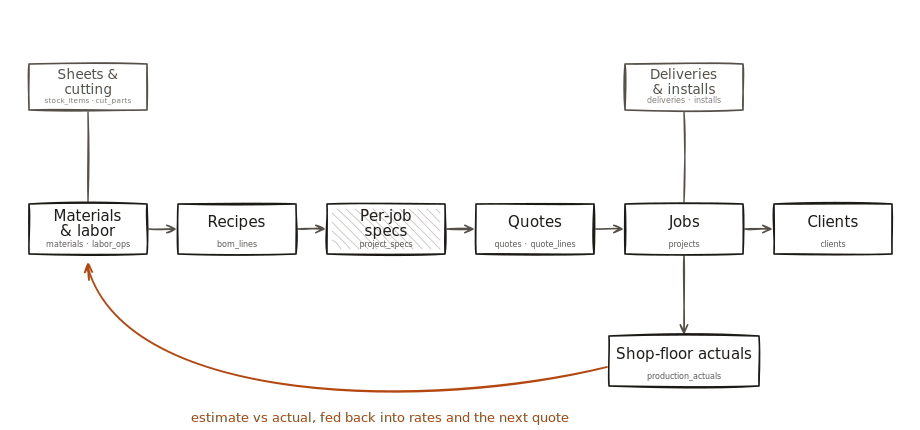
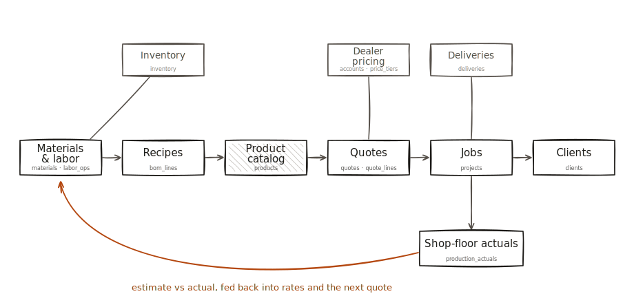
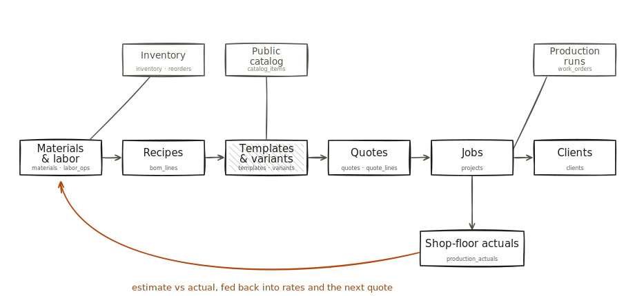
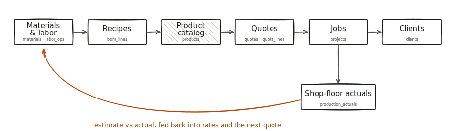

# Example blueprints

These are pre-generated outputs of the engine for four invented shops, committed so you can read real plans and schemas without running anything. Each folder holds the ten answers that define the shop (`answers.json`), the generated operations plan (`plan.md`), the database schema from the starter repo export (`schema.sql`), and the shop's Blueprint Map (`map.svg`). Regenerate them with `node scripts/build-blueprints.mjs`. The fifth and fullest example is the Northline walkthrough in [../examples/](../examples/), which follows one shop all the way from answers to a working build.

| Shop | The answers that define it | What its plan does differently |
| --- | --- | --- |
| [A custom cabinet shop](custom-cabinet-shop/plan.md) | custom, cuts sheet stock, installs on site, solo, on paper, quoting first | Models each job as `project_specs` instead of a product catalog, adds an `installs` table and a cut/nesting step (`cut_parts`, `stock_items`), and has no spreadsheet backfill step because the shop starts from paper. |
| [A catalog furniture maker](catalog-furniture-maker/plan.md) | catalog, sells through dealers, larger team, already on software, cost first | Adds dealer `accounts` and `price_tiers`, and orders the build cost-first: the true-cost model and variance capture land before the quote builder. |
| [A configurable sign shop](configurable-sign-shop/plan.md) | configurable, sells online, small team, spreadsheets, production first | Publishes an engine-priced public `catalog_items` surface, manages inventory with `reorder_rules` that raise purchase suggestions, and releases production runs through `work_orders`. |
| [A general job shop](general-job-shop/plan.md) | general products, catalog, small team, spreadsheets, direct one-offs | The minimal ten-table spine, `products` through `production_actuals`, with nothing bolted on: a useful baseline to compare the others against. |

## The maps

Each shop's map is a hand-drawn SVG generated by the same engine as its plan, from the same answers, so the picture and the text cannot disagree. The map shows the data spine that every shop gets (materials through clients), the modules that shop's answers switch on, and the estimate versus actual feedback loop.

### [A custom cabinet shop](custom-cabinet-shop/plan.md)

### [A catalog furniture maker](catalog-furniture-maker/plan.md)

### [A configurable sign shop](configurable-sign-shop/plan.md)

### [A general job shop](general-job-shop/plan.md)

