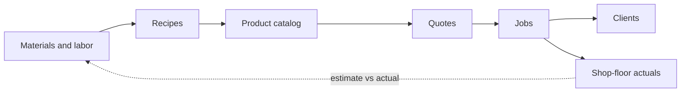

# Operations Blueprint

A foundation-first plan for a custom / made-to-order products operation. It rests on one idea: once you decompose your product into honest, relational data, the things above it (pricing, quoting, scheduling, sales) become outputs of that data rather than work you do by hand. The foundation and data sections are for you, the owner; the build, tooling, and integrator sections are for whoever implements it, whether that is you, a team member, or an AI agent you direct. Build it in the order below; each layer assumes the one before it is solid.

## 1. Foundation: the relational data model

Start here, because nothing above this layer holds if this layer is shaky. Your data already lives in spreadsheets. The job is to turn those columns into a related model, with one canonical row per thing referenced by id, so nothing is duplicated and everything can be joined.

Decompose your product to its atoms (every material, labor step, unit of time and overhead) and model it as related tables, not a pile of documents. Once the product is honest, joinable data, pricing, quoting, scheduling, and the customer-facing side all become functions of that data.

### A schema to start from

| Table | Key fields | Relationships |
| --- | --- | --- |
| products | id, name, sku, base_price | has many bom_lines; appears in quote_lines |
| materials | id, name, type, unit, cost_per_unit, vendor_id | referenced by bom_lines; belongs to a vendor |
| bom_lines | id, product_ref, material_id, qty, unit | binds a product to the materials it consumes (the bill of materials) |
| labor_ops | id, name, station, std_minutes, rate_per_hr | a product's routing references these to compute labor |
| vendors | id, name, lead_time_days, terms | supplies materials; drives purchasing |
| clients | id, name, contact, terms | owns projects and quotes |
| projects | id, client_id, status, created_at, due_date | a job from quote through delivery |
| quotes | id, project_id, version, total, status | priced output of the engine; versioned |
| quote_lines | id, quote_id, product_ref, qty, unit_price | the line items, each priced by the engine |
| production_actuals | id, project_id, material_used, time_used | what the floor actually consumed, compared back to the estimate |

The spine runs materials → bom_lines → products → quote_lines → quotes → projects → clients. Cost rolls up the left side; sales roll down the right; production_actuals close the loop back onto your estimates so the system corrects itself over time.

> Decompose before you automate. Every table above earns its place by being referenced. If something is just a document nobody joins to, it is a file, not data, and it will quietly drift out of date.

## 2. Process, SOPs, and the feedback loop

Map what actually happens on the floor, workarounds included, not the idealized version. You cannot optimize a process you have not honestly described.

### Operations and routing

Model each operation (cut, machine, assemble, finish, pack) as a labor_ops row with a station, a std_minutes, and a rate. A product's routing is its ordered list of operations, and labor cost is simply the sum of std_minutes times rate across that routing. Measure those times once, honestly; they are where estimates usually go wrong.

### The feedback loop (what makes it intelligent)

For every job, capture production_actuals: material actually consumed and time actually taken. Compare to the estimate. That variance is the most valuable data you produce, because it tells you whether the gap was a pricing error, a process problem, or a stale standard time, and which one. Feed it back into labor_ops and the next quote.

- Write one SOP per role and name the owner of each table. The rule: every record has exactly one source of truth and one person accountable for it.

Watch the seams between phases, which is where most failures happen (a spec changes after a quote is sent). For each handoff, decide what data moves forward, how you verify it arrived, and what happens when an upstream value changes after the fact.

## 3. Files, data, and the shape of the system

Everything resolves to one source of truth. A relational database (Postgres) is the core. A small backend service (an API) is the only thing that writes to it, so every surface (internal tools, a customer view, reports) goes through the same logic and cannot drift. Documents (drawings, PDFs) live in a file or object store, referenced by id from the database, never treated as the source of truth themselves.

- One shared Postgres instance, the API in front of it, and a shared document area (a file server or a Google Drive) referenced by id from the database so nothing important lives in two places. Access by role.

Keep a predictable repository layout, one area per domain (products, materials, projects, quotes, docs), and give each folder a short context file describing what it is and its conventions, so any teammate or AI coding agent is immediately productive there instead of starting cold.

## 4. Build action items, ordered for your priority (keeping catalog and pricing current)

Build incrementally, one deployable piece at a time, so the system keeps working for the people who use it while you are still changing it. Each item below names the tables and logic it needs and assumes the ones above it exist.

1. Product-and-cost engine (build this first; everything depends on it). Tables: the product/template/spec, bom_lines, materials, labor_ops. Build a cost(product_ref, options) service that joins the product to its bom_lines (sum of material.cost_per_unit times qty) and to its routing (sum of labor_ops.std_minutes / 60 times rate_per_hr), then adds overhead and margin and writes an audit row on every price change. Every other surface calls this one function; nothing prices on its own. Decide once where overhead lives (inside a loaded labor rate or as its own line, never both) so it cannot be double-counted, and when a line cannot be priced (a material with no cost, an operation the model does not know) surface it rather than dropping it silently.
2. Backfill from what you already have. Import your current spreadsheets into the schema in one pass: map each sheet to its table, normalize units and keys (ft vs foot, ea vs each) and dedupe, and keep anything that does not map cleanly in a notes column so nothing is lost. This is usually where the real mess surfaces; fix it in the data once, here.
3. Catalog and document generation. A generator that reads products and materials at request time and renders the catalog and spec docs (GET /catalog, plus per-product spec sheets). Keep curated fields (descriptions) in their own columns so regeneration never overwrites them, and stamp provenance (source, as_of) on each derived field.
4. True-cost model. Derive each station rate_per_hr from (labor + overhead + machine cost) over available hours instead of typing it, and snapshot the computed cost onto the project when work completes, so historical cost does not move when current rates change. The engine reads the derived rate.
5. Quote builder. Tables: quotes, quote_lines (versioned). Endpoint POST /quotes that calls the engine per line for unit_price (applying a dealer tier discount where relevant), persists the lines, totals the quote, and returns it; GET /quotes/:id/pdf renders it. Internal and customer-facing quoting both go through the one engine, so they cannot disagree.
6. Production capture and variance. Table: production_actuals. Capture material_used and time_used per job (import from the floor or enter), then a variance view that joins actuals to the estimate by operation and station (time_used vs std_minutes, material_used vs bom qty) and feeds corrections back into labor_ops.

### What to log, at field level

In order: materials (cost_per_unit, unit), labor_ops (std_minutes, rate_per_hr), the bom_lines that bind them to products, then quote_lines and quotes, then production_actuals (material_used, time_used). Each layer is only as trustworthy as the one beneath it.

## 5. Tooling: a self-hostable stack

A stack a small shop can actually run, open and free to start. You do not need all of it on day one; add pieces as the layers above demand them.

- Postgres: the relational core and single source of truth.
- A backend service (Python/FastAPI or Node) as the only writer to the database, so every surface shares one set of logic.
- Docker: run every piece the same way on any machine, dev or production.
- A queue and cache (Redis) once you have background work like document generation or imports.
- A vector store (Qdrant) when you add the knowledge layer: semantic search over SOPs and specs.
- n8n: low-code automation for the glue (scheduled jobs, notifications, syncs).
- nginx: a reverse proxy in front of the API and any UI.

### Hosting and access

For internal-only use, one small server is enough. When people need it off-site (a quote at a client, a status check on a phone), put the API behind Cloudflare (a tunnel plus access control) and a domain, so you expose it safely without opening your network.

### Build it with an agent

This plan is written to double as context for an AI coding agent. Hand it the blueprint plus a per-folder context file, and build one deployable piece at a time, reading every change before it lands. The hard part is not writing the code; it is keeping the system correct while real people depend on it.

- [PostgreSQL docs](https://www.postgresql.org/docs/)
- [Docker docs](https://docs.docker.com/)
- [FastAPI](https://fastapi.tiangolo.com/)
- [Qdrant](https://qdrant.tech/documentation/)
- [n8n](https://docs.n8n.io/)
- [Cloudflare Tunnel](https://developers.cloudflare.com/cloudflare-one/connections/connect-networks/)

## 6. The AI integrator: building and operating it

Someone has to turn this data into running systems, and increasingly that someone is an "AI integrator": not necessarily a career developer, but a person who can structure data, build the systems and endpoints on top of it, and direct AI agents to do most of the building and the routine work. On a small team, one person should own this end to end. It need not be a career developer; it needs someone who can think in data and direct AI agents.

The job is three moves: structure the data (sections 1 to 3), build the systems on it (section 4), then put an agent on every repetitive step so the laborious parts run themselves while you keep the judgment.

### Configure your agents

Work folder by folder. Give each part of the system (the engine, the quote service, the document generator, the knowledge base) its own directory with a short context file, its own memory of decisions made, and the skills it repeats, so a fresh agent dropped in is immediately useful. You can run several agents at once across folders; you are the orchestrator, and the work is only ever as coordinated as you make it.

- [Build the Expertise Into Each Folder](https://damiankao.com/writing/build-the-expertise-into-each-folder)
- [Agentic Practice](https://damiankao.com/practice)

### Read and combine the data into answers

The tables are only worth building because of what you join them into. The patterns worth building first:

- Pricing is a join, and that join is your quote engine: product to bom_lines to materials for material cost, product to routing to labor_ops for labor, plus overhead and margin. Build it once; everything prices through it.
- A contract is not a new document, it is a locked, versioned snapshot of priced quote_lines plus terms, generated from the same engine, so the contract can never disagree with the quote it came from.
- Time efficiency: group production_actuals by operation and station and compare time_used to std_minutes. The variance tells you which standard times are wrong and where the floor actually loses time.
- Material and vendor allocation: aggregate bom_lines across materials and vendors to see spend by material and by vendor, lead-time exposure, and where consolidating purchasing pays off.
- Margin and mix: roll cost and price up to product, client, and channel to see what actually makes money, not just what sells.

### The documents and reports to generate (from data, not by hand)

| Document | When | Generated from |
| --- | --- | --- |
| Quotation / estimate | On request, per project | quotes + quote_lines (engine) |
| Contract | On win | locked quote snapshot + terms |
| Spec sheet | Per product / order | product/spec + materials |
| Work order | On release to the floor | projects + routing |
| Invoice | On delivery / milestone | project + quote totals |
| Efficiency / time-study report | Weekly or per job | production_actuals vs labor_ops |
| Material and vendor report | Monthly | bom_lines, materials, vendors |
| As-built / end-product record | On completion | project + actuals + final spec |
| Customer requirements and conversation log | Ongoing | client + project notes |
| Reviews and feedback | After delivery | client + project |
| Change orders | On scope change | project + new quote version |

### Put AI on each step (with guardrails)

Give an agent read-scoped access to the database and a retrieval layer (vector search over your SOPs, specs, and past projects) so it answers in your context, not generically. Then hand it the repetitive steps: drafting a quote from a stated requirement, generating the documents above, summarizing a customer conversation into structured requirements on the project, producing the reports, and recommending a material or process from what worked before. A human approves anything that goes out the door.

> Automate the laborious, keep the judgment. The goal is not to replace people; it is to let a small team run an operation that used to need a big one, by handing every repetitive document, report, and lookup to an agent that works from your real data.
