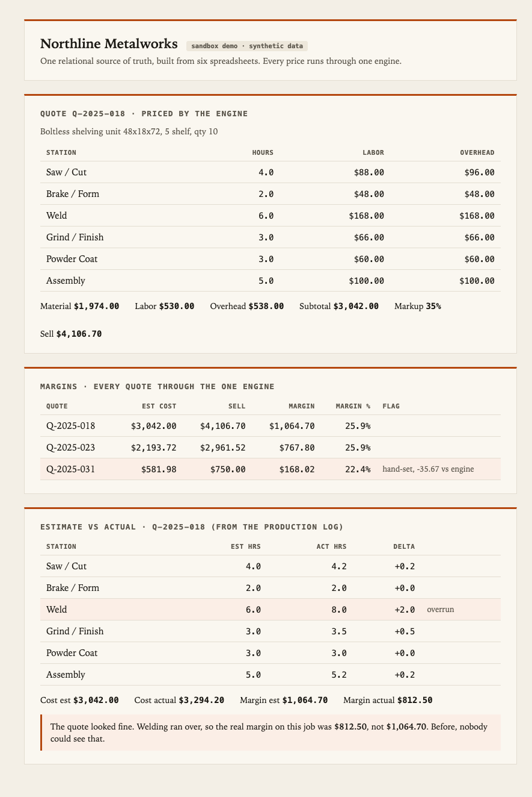

# 05 · Results (what the system produced)

The "after." Northline's six spreadsheets were ingested into one relational database, and every quote
was priced through a single engine. Two problems that were invisible in the spreadsheets showed up on
their own. All numbers are synthetic but internally consistent, and each one hand-checks against the
source workbooks.

- Full terminal transcript: `demo-output.txt`
- Rendered view: `report.html` (screenshot: `screenshots/report.png`)
- Reproduce: from `../04-build`, `python3 run_demo.py` then `python3 report_html.py`

## From six files to one source of truth
The ingest step loaded, and reconciled, everything the shop kept by hand: **11 materials, 7 labor
stations, 8 clients, 3 quotes (18 material lines + 18 labor lines), 13 production-log entries.** On the
way in it normalised the inconsistent units (`foot` → `ft`, `each` → `ea`) and kept the blank-cost
`MISC` line instead of letting it silently drop a cost.

## A quote, priced by the one engine
`Q-2025-018` (boltless shelving, qty 10):

| | |
| --- | --- |
| Material | $1,974.00 |
| Labor | $530.00 |
| Overhead | $538.00 |
| Subtotal | $3,042.00 |
| Markup | 35% |
| **Sell** | **$4,106.70** |

Material is the join of the quote's lines to the price list; labor and overhead are the join of its
hours to the station rates. One function, and now every surface prices the same way.

## Finding 1: a hidden margin leak (the hand-set price)
Priced through the engine, every quote is comparable:

| Quote | Est cost | Sell | Margin | Margin % | Flag |
| --- | ---: | ---: | ---: | ---: | --- |
| Q-2025-018 | $3,042.00 | $4,106.70 | $1,064.70 | 25.9% | |
| Q-2025-023 | $2,193.72 | $2,961.52 | $767.80 | 25.9% | |
| Q-2025-031 | $581.98 | $750.00 | $168.02 | 22.4% | **hand-set, -35.67 vs engine** |

`Q-2025-031`'s sell price was typed in by hand at $750; the engine says $785.67. In the spreadsheet that
override was invisible. Through one engine, it stands out the moment it happens.

## Finding 2: where the money actually went (the overrun)
`Q-2025-018` was built, so the production log lets estimate meet actual:

| Station | Est hrs | Act hrs | Delta |
| --- | ---: | ---: | ---: |
| Saw / Cut | 4.0 | 4.2 | +0.2 |
| Brake / Form | 2.0 | 2.0 | 0.0 |
| **Weld** | **6.0** | **8.0** | **+2.0 (overrun)** |
| Grind / Finish | 3.0 | 3.5 | +0.5 |
| Powder Coat | 3.0 | 3.0 | 0.0 |
| Assembly | 5.0 | 5.2 | +0.2 |

Estimated cost $3,042.00; actual cost $3,294.20. So the real margin on this job was **$812.50, not
$1,064.70.** The job "felt tight" and nobody could say why. Now the number, and the station, are right
there. That variance is exactly what feeds back onto the next estimate.

## The point
Neither finding required new data. It was all already in the shop's spreadsheets; it just could not be
joined or compared. Structure the data once, price everything through one engine, and close the loop
from actuals back to estimates, and the operation becomes legible. That is the blueprint's whole thesis,
shown running on one shop's worth of data.
